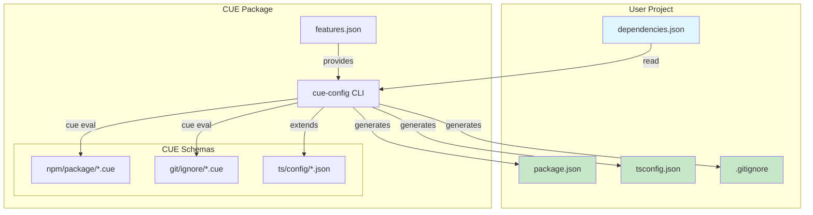
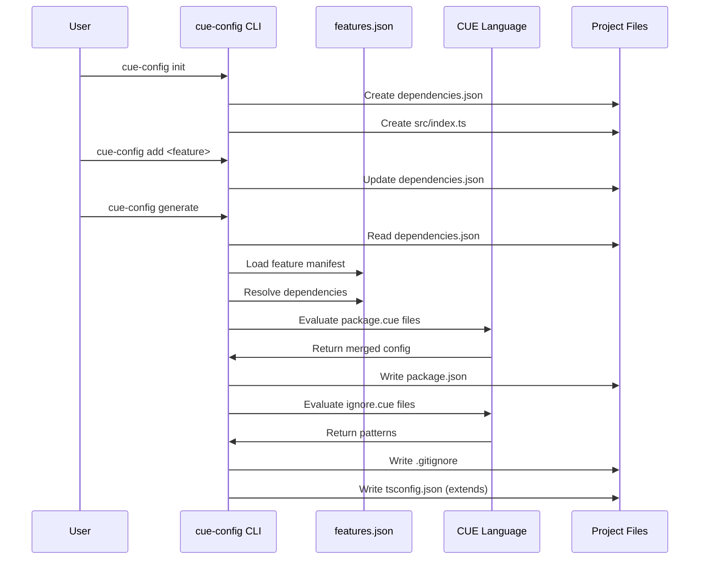
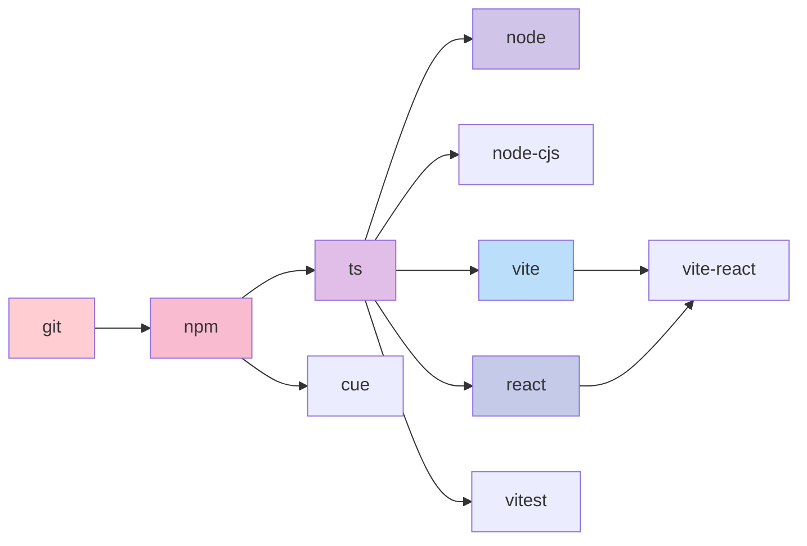
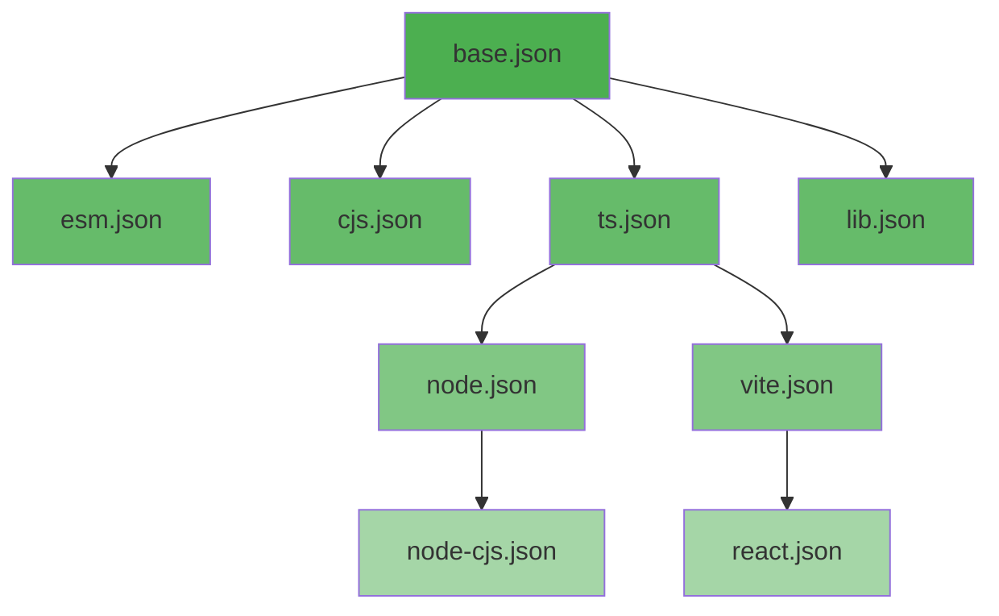

# @mark1russell7/cue

[](https://www.npmjs.com/package/@mark1russell7/cue)
[](https://opensource.org/licenses/MIT)

> Shared CUE schemas and templates for TypeScript project configuration

## Overview

`@mark1russell7/cue` is a configuration management package that provides a feature-based system for generating TypeScript project configurations. It uses [CUE](https://cuelang.org/) for schema validation and configuration generation, enabling consistent, type-safe, and composable project setups across the ecosystem.

### Key Features

- **Feature-Based Configuration**: Modular features (git, npm, ts, node, react, vite, etc.) that compose together
- **Automatic Config Generation**: Generates `package.json`, `tsconfig.json`, and `.gitignore` from declared features
- **CUE Schema Validation**: Validates configurations against CUE schemas for correctness
- **Preset System**: Pre-configured feature bundles for common project types (lib, react-lib, app)
- **Dependency Resolution**: Automatically resolves transitive feature dependencies
- **Self-Dogfooding**: The package uses itself for configuration management

## Architecture



## Installation

```bash
npm install --save-dev @mark1russell7/cue
```

### Prerequisites

- Node.js >= 25.0.0
- npm >= 11.0.0
- [CUE CLI](https://cuelang.org/docs/install/) installed and available in PATH

## Configuration Flow



## API Reference

### CLI Commands

The package provides a `cue-config` binary with the following commands:

#### `init [--preset NAME]`

Initialize a new project with a feature preset.

**Options:**
- `--preset NAME` - Preset to use (default: `lib`)
- `--force` - Overwrite existing dependencies.json

**Available Presets:**
- `lib` - TypeScript library (ts, cue, vitest)
- `react-lib` - React library (react, cue, vitest)
- `app` - Vite + React application (vite-react, cue, vitest)

**Example:**
```bash
npx cue-config init --preset react-lib
```

#### `add <feature>`

Add a feature to dependencies.json.

**Example:**
```bash
npx cue-config add node
```

#### `remove <feature>`

Remove a feature from dependencies.json.

**Example:**
```bash
npx cue-config remove vite
```

#### `generate`

Generate all configuration files from dependencies.json.

Generates:
- `package.json` (via CUE evaluation)
- `tsconfig.json` (extends appropriate base config)
- `.gitignore` (via CUE evaluation)
- `cue.mod/` (if `cue` feature is enabled)

**Example:**
```bash
npx cue-config generate
```

#### `validate`

Validate dependencies.json against schema.

**Example:**
```bash
npx cue-config validate
```

#### `validate-manifest [--path PATH]`

Validate an ecosystem.manifest.json file against the CUE schema.

**Options:**
- `--path PATH` - Path to manifest file (default: `./ecosystem.manifest.json`)

**Example:**
```bash
npx cue-config validate-manifest --path ../ecosystem/ecosystem.manifest.json
```

#### `validate-structure [--path PATH]`

Validate project folder structure against template.

**Options:**
- `--path PATH` - Path to project directory (default: current directory)

**Example:**
```bash
npx cue-config validate-structure
```

#### `self-generate`

Generate package.json for the cue package itself (dogfooding).

**Example:**
```bash
npm run generate:self
```

### Package Exports

#### Configuration Templates

```typescript
// Import TypeScript config templates
import baseConfig from "@mark1russell7/cue/ts/config/base.json";
import esmConfig from "@mark1russell7/cue/ts/config/esm.json";
import nodeConfig from "@mark1russell7/cue/ts/config/node.json";
import reactConfig from "@mark1russell7/cue/ts/config/react.json";
import viteConfig from "@mark1russell7/cue/ts/config/vite.json";
```

**Available TypeScript Configs:**
- `base.json` - Base TypeScript configuration
- `esm.json` - ESM module configuration
- `cjs.json` - CommonJS configuration
- `lib.json` - Library configuration
- `ts.json` - TypeScript-only configuration
- `node.json` - Node.js configuration
- `node-cjs.json` - Node.js CommonJS configuration
- `vite.json` - Vite configuration
- `react.json` - React configuration

#### Features Manifest

```typescript
// Access features.json
import features from "@mark1russell7/cue/features.json";
```

#### Dependency Schemas

```typescript
// Access dependency schemas
import schema from "@mark1russell7/cue/dependencies/schema.json";
```

## Feature System

### Available Features



| Feature | Dependencies | Description |
|---------|-------------|-------------|
| `git` | none | Git configuration (.gitignore patterns) |
| `npm` | git | NPM package basics |
| `ts` | npm | TypeScript support |
| `node` | ts | Node.js runtime support |
| `node-cjs` | ts | Node.js CommonJS support |
| `react` | ts | React library support |
| `vite` | ts | Vite build tool support |
| `vite-react` | vite, react | Vite + React application |
| `cue` | npm | CUE configuration support |
| `vitest` | ts | Vitest testing framework |

### Feature Resolution

Features are resolved transitively using a flood-fill algorithm:

```typescript
// Example: Adding 'vite-react' automatically includes:
// - vite-react (requested)
// - vite (dependency of vite-react)
// - react (dependency of vite-react)
// - ts (dependency of vite and react)
// - npm (dependency of ts)
// - git (dependency of npm)
```

### dependencies.json Format

```json
{
  "$schema": "./node_modules/@mark1russell7/cue/dependencies/schema.json",
  "dependencies": ["ts", "node", "vitest"]
}
```

## Usage Examples

### Creating a New TypeScript Library

```bash
# Initialize with library preset
npx cue-config init --preset lib

# Generate configuration files
npx cue-config generate

# Install dependencies
npm install

# Build
npm run build
```

### Creating a React Library

```bash
# Initialize with React library preset
npx cue-config init --preset react-lib

# Generate configs
npx cue-config generate

# Install and build
npm install
npm run build
```

### Creating a Vite + React App

```bash
# Initialize with app preset
npx cue-config init --preset app

# Generate configs
npx cue-config generate

# Install and dev
npm install
npm run dev
```

### Adding Node.js Runtime Support

```bash
# Add node feature
npx cue-config add node

# Regenerate configs
npx cue-config generate

# The tsconfig.json now extends node.json with Node types
```

### Custom Feature Combination

```bash
# Start minimal
npx cue-config init

# Build custom stack
npx cue-config add ts
npx cue-config add node
npx cue-config add vitest

# Generate
npx cue-config generate
```

## TypeScript Configuration

The package provides a hierarchy of TypeScript configurations:



### Configuration Priority

When multiple features are enabled, the most specific configuration is selected:

**Priority order** (highest to lowest):
1. `react` - React applications
2. `vite` - Vite projects
3. `node-cjs` - Node.js CommonJS projects
4. `node` - Node.js projects
5. `ts` - TypeScript-only (default)

Example:
```bash
# If you have: ts + node + react
# → tsconfig.json extends react.json (highest priority)

# If you have: ts + node
# → tsconfig.json extends node.json
```

## Integration with Ecosystem

The `cue` package integrates with the broader `@mark1russell7` ecosystem:

### Ecosystem Manifest Validation

```bash
# Validate ecosystem.manifest.json
npx cue-config validate-manifest --path ~/git/ecosystem/ecosystem.manifest.json
```

### Project Structure Validation

The package reads the `projectTemplate` from `ecosystem.manifest.json` to validate project structure:

```bash
npx cue-config validate-structure
```

This checks for:
- Required files: `package.json`, `tsconfig.json`, `dependencies.json`, `.gitignore`
- Required directories: `src/`, `dist/`

### Used By

The following packages depend on `@mark1russell7/cue`:

- `@mark1russell7/cli` - CLI uses cue for configuration
- `@mark1russell7/ecosystem` - Ecosystem manifest uses cue schemas
- `@mark1russell7/logger` - Logger uses cue for build config
- All `client-*` packages - All clients use cue for configuration
- All `bundle-*` packages - All bundles use cue for configuration

## CUE Schema Structure

### NPM Package Schema

Located in `npm/package/*.cue`, these schemas define package.json structure:

- `base.cue` - Base package.json fields
- `ts.cue` - TypeScript-specific fields
- `node.cue` - Node.js-specific fields
- `react.cue` - React-specific fields
- `vite.cue` - Vite-specific fields
- `viteReact.cue` - Vite + React fields

### Git Ignore Schema

Located in `git/ignore/*.cue`, these schemas define .gitignore patterns:

- `base.cue` - Base ignore patterns (node_modules, dist, etc.)
- `ts.cue` - TypeScript build artifacts
- `node.cue` - Node.js-specific patterns
- `react.cue` - React-specific patterns
- `vite.cue` - Vite build outputs

### Dependencies Schema

Located in `dependencies/schema.cue`, validates dependencies.json format.

### Ecosystem Schema

Located in `ecosystem/schema.cue`, validates ecosystem.manifest.json format.

## Advanced Usage

### CUE Module Setup

If you include the `cue` feature, the package sets up a CUE module in your project:

```bash
npx cue-config add cue
npx cue-config generate
```

This creates:
```
cue.mod/
├── module.cue
└── pkg/
    └── mark1russell7.cue/  (symlink to @mark1russell7/cue)
```

You can then use the CUE schemas in your own `.cue` files:

```cue
import "mark1russell7.cue/npm/package"

myPackage: package.#Package & {
    name: "my-package"
    version: "1.0.0"
}
```

### Programmatic Usage

While primarily a CLI tool, you can use the internal functions programmatically:

```typescript
import { readFileSync, writeFileSync } from "node:fs";

// Load features
const features = JSON.parse(readFileSync("features.json", "utf-8"));

// Resolve dependencies manually
const requested = ["react", "vitest"];
const resolved = new Set();
const queue = [...requested];

while (queue.length > 0) {
  const feature = queue.shift()!;
  if (resolved.has(feature)) continue;

  const featureDef = features.features[feature];
  if (featureDef) {
    resolved.add(feature);
    queue.push(...featureDef.dependencies);
  }
}

console.log([...resolved]);
// ["react", "vitest", "ts", "npm", "git"]
```

## Development

### Building the Package

```bash
npm run build
```

### Self-Generation

The package uses itself for configuration:

```bash
npm run generate:self
```

This regenerates the package's own `package.json` using the CUE schemas.

### File Structure

```
cue/
├── src/
│   └── cli.ts              # Main CLI implementation
├── ts/
│   └── config/             # TypeScript configuration templates
│       ├── base.json
│       ├── esm.json
│       ├── node.json
│       ├── react.json
│       └── ...
├── npm/
│   └── package/            # NPM package CUE schemas
│       ├── base.cue
│       ├── ts.cue
│       ├── node.cue
│       └── ...
├── git/
│   └── ignore/             # Gitignore CUE schemas
│       ├── base.cue
│       ├── ts.cue
│       └── ...
├── dependencies/
│   └── schema.cue          # Dependencies schema
├── ecosystem/
│   └── schema.cue          # Ecosystem manifest schema
├── features.json           # Feature definitions
├── dependencies.json       # Package's own dependencies
└── package.json            # Generated from CUE schemas
```

## Troubleshooting

### CUE Not Installed

```
Error: CUE is not installed.
Install from: https://cuelang.org/docs/install/
```

**Solution:** Install the CUE CLI from [cuelang.org](https://cuelang.org/docs/install/)

### Invalid Feature

```
Unknown feature: 'foo'
Available: git, npm, ts, node, node-cjs, react, vite, vite-react, cue, vitest
```

**Solution:** Use one of the available features or check for typos.

### CUE Evaluation Failed

```
CUE evaluation failed for package.json:
[error details]
```

**Solution:** This usually indicates a CUE schema error. Check that:
1. All `.cue` files in the package are valid
2. No conflicting constraints exist
3. Run `cue eval` manually to debug

### Missing dependencies.json

```
No dependencies.json found. Run: npx cue-config init
```

**Solution:** Initialize the project with `npx cue-config init`

## License

MIT

## Repository

https://github.com/mark1russell7/cue

## Author

Mark Russell <marktheprogrammer17@gmail.com>
